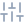

<div align="center">


# 番茄钟 Pomodoro

[English](#-english) | [中文](#-中文)

**A minimal Windows & macOS desktop pomodoro with an aurora-glass UI · Local-first · No account**

**极光玻璃质感的桌面番茄钟 · 极简 · 本地 · 免登录**

一个番茄，一次专注。到点黑洞休息动画游走全屏，数据全部留在你的电脑里。

One tomato, one focus. When time's up, a black-hole animation drifts across your screen for a forced break — and all data stays on your machine.

[](#-快速开始--quick-start)
[](https://tauri.app)
[](https://www.rust-lang.org)
[](https://svelte.dev)
[](#-快速开始--quick-start)
[](#-快速开始--quick-start)
[](#-快速开始--quick-start)

</div>

---

##  English

### Highlights

| | | |
|---|---|---|
|  | **Feather-light** | **2.2 MB** NSIS installer, 6 MB portable exe — instant startup even on old machines |
|  | **Aurora-glass UI** | Drifting aurora glows, frosted-glass surfaces, dark / light / auto themes |
|  | **Focus mode** | Hit "Start" and the panel glides into a full-screen gradient ring countdown |
|  | **Black-hole break** | Finishing a pomodoro summons a full-screen black-hole animation for a 1-minute break you can't skip |
|  | **Visible progress** | Today / weekly focus hours, 7-day bar chart, daily timeline, recent sessions |
|  | **Local-first** | SQLite storage, no sign-up; crash-safe session recovery; corrupted DB auto-backup & rebuild |
|  | **Just-enough settings** | Sound / system notification / launch at login — nothing more, nothing less |

###  Quick Start

**Download** from [**Releases**](../../releases): `番茄钟_x.x.x_x64-setup.exe` (Windows installer) or `pomodoro.exe` (portable, needs WebView2 bundled with Win11). macOS builds (`.dmg`) are produced from source on a Mac.

**Build from source:**

```bash
# Prerequisites: Node.js 18+, Rust stable (msvc on Windows / Xcode CLT on macOS)
git clone <repo-url>
cd pomodoro/pomodoro

npm install
npm run tauri dev    # develop
npm run tauri build  # NSIS installer on Windows · .app + .dmg on macOS
```

###  At a Glance

```
+---------------------------+
|  Pomodoro          [o] [=]|
|                           |
|   [25m] [45m] [1h]        |  <- quick presets, or custom min/hour/day
|                           |
|   Task note...   12/20    |  <- write your goal down first
|                           |
|       > Start Focus       |  <- panel glides into a ring countdown
|                           |
|   Today  #####...         |
+---------------------------+
     done -> chime + system notification
          -> black-hole break, 1 minute
```

###  Tech Stack

Tauri 2 · Rust (`rusqlite` WAL, `chrono`, `tokio`) · Svelte 4 + TypeScript + Vite · `cargo test` (27) + `vitest` (10) + `svelte-check` 0 warnings

###  License

For learning purposes only.

---

##  中文

### 为什么选择它

| | | |
|---|---|---|
|  | **轻若无物** | NSIS 安装包仅 **2.2 MB**，绿色版单文件 6 MB，老电脑也秒开 |
|  | **极光玻璃 UI** | 三团极光光晕缓慢流动，全局磨砂玻璃质感，深色 / 浅色 / 跟随系统三档自适应 |
|  | **专注即全屏** | 点击「开始专注」，面板丝滑切换为渐变圆环倒计时视图，一眼只看时间 |
|  | **黑洞休息** | 完成番茄，全屏黑洞虹吸动画游走 1 分钟——护眼休息，硬性执行，不靠自觉 |
|  | **专注看得见** | 今日 / 本周专注时长、7 天柱状图、今日时间轴、最近记录，一屏尽览 |
|  | **数据永不离身** | 本地 SQLite 存储，无需注册登录；崩溃自动恢复，数据库损坏自动备份重建 |
|  | **恰到好处的设置** | 提示音 / 系统通知 / 开机自启，一个不多，一个不少 |

###  快速开始

**直接下载**：前往 [**Releases**](../../releases) 获取 `番茄钟_x.x.x_x64-setup.exe`（安装版）或 `pomodoro.exe`（绿色版，需系统 WebView2，Win11 自带）。macOS 的 `.dmg` 需在 Mac 上从源码构建。

**从源码构建：**

```bash
# 前置：Node.js 18+ 与 Rust stable（Windows 用 msvc / macOS 装 Xcode CLT）
git clone <仓库地址>
cd 番茄钟/pomodoro

npm install
npm run tauri dev    # 开发调试
npm run tauri build  # Windows 产出 NSIS · macOS 产出 .app + .dmg
```

###  使用一览

```
+---------------------------+
|  番茄钟            [图] [设]|
|                           |
|   [25分] [45分] [1时]     |  <- 快速时长，或自定义 分钟/小时/天
|                           |
|   任务备注...    12/20 字  |  <- 写下目标，更易进入状态
|                           |
|       开始专注            |  <- 点击后面板切换为
|                           |     渐变圆环全屏倒计时
|   今日时间轴 #####...      |
+---------------------------+
     完成 -> 提示音 + 系统通知
         -> 黑洞休息动画 1 分钟
```

###  技术栈

| 层 | 技术 |
|---|---|
| 桌面框架 | Tauri 2（单 WebView，安装包 2.2 MB） |
| 后端 | Rust · `rusqlite`(WAL) · `chrono` · `tokio(time)` · 息屏/动画休息跨平台 |
| 前端 | Svelte 4 + TypeScript + Vite · 自绘极光玻璃主题 |
| 质量 | `cargo test`（27 项）· `vitest`（10 项）· `svelte-check` 0 警告 |

###  目录结构

```
pomodoro/
├── src/                  # Svelte 前端
│   ├── lib/
│   │   ├── Panel.svelte  # 主面板（计时 / 统计 / 设置 / 确认弹窗）
│   │   ├── Stats.svelte  # 统计视图（KPI / 柱状图 / 时间轴）
│   │   ├── Rest.svelte   # 黑洞休息动画（Canvas 粒子）
│   │   └── *.ts          # 纯函数业务层 + IPC 封装
│   └── app.css           # 极光玻璃主题（全局）
└── src-tauri/            # Rust 后端（跨平台）
    └── src/
        ├── commands.rs   # Tauri IPC 命令 + 计时循环
        ├── timer.rs      # 计时状态机
        ├── store.rs      # SQLite DAO（WAL）
        ├── rest.rs       # 休息窗口生命周期
        └── ...
```

###  Roadmap

- 休息倒计时置顶小窗
- 长休息 / 番茄工作法四轮循环
- 数据导出 CSV

###  许可

仅供学习交流使用。

---

<div align="center">

**专注当下，一次一个番茄。** — **One tomato at a time.**

</div>
