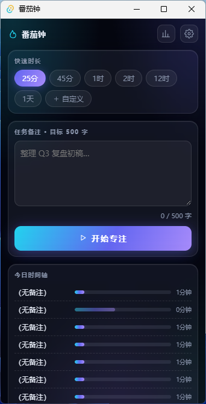

<div align="center">


# 番茄钟 Pomodoro

**A minimal Windows & macOS desktop pomodoro with an aurora-glass UI · Local-first · No account**

One tomato, one focus. When time's up, a black-hole animation drifts across your screen for a forced break — and all data stays on your machine.

English | [简体中文](./README.zh-CN.md)

[](#quick-start)
[](https://tauri.app)
[](https://www.rust-lang.org)
[](https://svelte.dev)
[](#quick-start)
[](#quick-start)
[](#quick-start)

</div>

---

## Highlights

| | | |
|---|---|---|
|  | **Feather-light** | **2.2 MB** NSIS installer, 6 MB portable exe — instant startup even on old machines |
|  | **Aurora-glass UI** | Drifting aurora glows, frosted-glass surfaces, dark / light / auto themes |
|  | **Focus mode** | Hit "Start" and the panel glides into a full-screen gradient ring countdown |
|  | **Black-hole break** | Finishing a pomodoro summons a full-screen black-hole animation for a 1-minute break you can't skip |
|  | **Visible progress** | Today / weekly focus hours, 7-day bar chart, daily timeline, recent sessions |
|  | **Local-first** | SQLite storage, no sign-up; crash-safe session recovery; corrupted DB auto-backup & rebuild |
|  | **Just-enough settings** | Sound / system notification / launch at login — nothing more, nothing less |

## Screenshot

<div align="center">
  
</div>

## Quick Start

**Download** from [**Releases**](../../releases): `番茄钟_x.x.x_x64-setup.exe` (Windows installer) or `pomodoro.exe` (portable, needs WebView2 bundled with Win11). macOS builds (`.dmg`) are produced from source on a Mac.

**Build from source:**

```bash
# Prerequisites: Node.js 18+, Rust stable (msvc on Windows / Xcode CLT on macOS)
git clone <repo-url>
cd pomodoro/pomodoro

npm install
npm run tauri dev    # develop
npm run tauri build  # NSIS installer on Windows · .app + .dmg on macOS
```

## At a Glance

```
+---------------------------+
|  Pomodoro          [o] [=]|
|                           |
|   [25m] [45m] [1h]        |  <- quick presets, or custom min/hour/day
|                           |
|   Task note...   12/20    |  <- write your goal down first
|                           |
|       > Start Focus       |  <- panel glides into a ring countdown
|                           |
|   Today  #####...         |
+---------------------------+
     done -> chime + system notification
          -> black-hole break, 1 minute
```

## Tech Stack

Tauri 2 · Rust (`rusqlite` WAL, `chrono`, `tokio`) · Svelte 4 + TypeScript + Vite · `cargo test` (27) + `vitest` (10) + `svelte-check` 0 warnings

## Project Layout

```
pomodoro/
├── src/                  # Svelte frontend
│   ├── lib/
│   │   ├── Panel.svelte  # main panel (timer / stats / settings / dialogs)
│   │   ├── Stats.svelte  # stats view (KPI / bars / timeline)
│   │   ├── Rest.svelte   # black-hole break animation (canvas particles)
│   │   └── *.ts          # pure business logic + IPC bindings
│   └── app.css           # aurora-glass theme
└── src-tauri/            # Rust backend (cross-platform)
    └── src/
        ├── commands.rs   # Tauri IPC commands + tick loop
        ├── timer.rs      # timer state machine
        ├── store.rs      # SQLite DAO (WAL)
        ├── rest.rs       # rest-window lifecycle
        └── ...
```

## Roadmap

- Rest countdown as a mini overlay
- Long breaks / classic 4-cycle pomodoro
- CSV export

## License

For learning purposes only.

---

<div align="center">

**One tomato at a time.**

</div>
